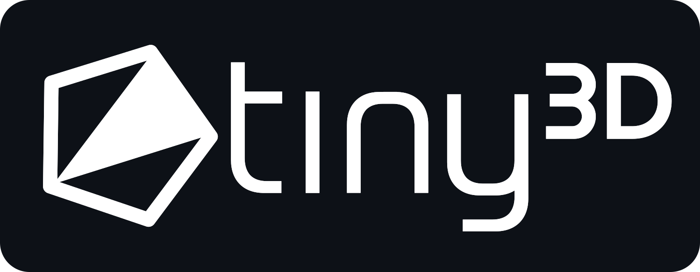
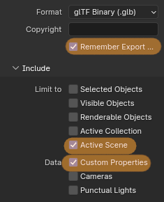

# Tiny3D

<p align="center">

</p>

3D ucode/library for the N64 using [libdragon](https://github.com/DragonMinded/libdragon/tree/preview).<br>
The motivation of this project is to provide a fast and easy API while having all the features needed for 3D applications.<br>

## Features
Tiny3D comes with both RSP microcode and an easy to use C-API around it.<br>
Features include:
- Full 3D Pipeline for loading and rendering meshes
- Matrix stack and functions
- Lighting with ambient, directional and point-lighting
- Normals & Color at the same time with 16bytes per vertex
- Culling functions and BVH tree creation
- Skinned Meshes & Animation support
    - fake-blending with 1 bone per vertex / up to 3 bones per triangle
    - animation blending
    - (compressed) animation streaming from ROM
    - attachment of non-skeletal targets (e.g. camera)
- GLTF importer with Fast64 support ([supported settings](docs/fast64Settings.md))
    - Vertex cache optimization
    - Triangle strip optimization
    - Automatic texture loading
    - Applies CC and related settings set in Fast64
- Direct interop. with the RDPQ API.

Checkout the playlist showcasing the example projects in this repo:<br>
<p align="center">
<a href="https://www.youtube.com/watch?v=RIVDqBZXbwI&list=PLIjz3uuaFuI60LKKjrtr3TgKyvepZ6tV0" target="_blank">
    
</a>
</p>

## Usage
Checkout this repository and build it first (see the Build section), no prebuilts are provided.<br>
To use Tiny3D in your project, add the following line in your Makefile:
```make
include $(N64_INST)/include/t3d.mk
```
Internally this will handle the required configuration to link Tiny3D itself into you project.<br>

If you prefer to keep a local copy of Tiny3D in your project, then just do so (eg: a submodule)
and include t3d.mk from there:
```make
include path/to/t3d.mk
```
This will make sure that that specific copy of Tiny3D is used instead.

In general, it's easier to simply take one of the included example projects as a starting point.<br>
These can be found in the `examples` directory, where each of them goes into details about different features.<br>

To start out, take a look at `examples/01_quad` which is the most basic setup drawing a single 3D quad.<br>

### API Reference

(@TODO: generate docs from comments, add github page for it)

### GLTF Model import
Tiny3D comes with a build-in model format and an importer for GLTF files.<br>
In order to best use the N64 hardware, it is recommended to use [Fast64](https://github.com/Fast-64/fast64).<br>

> **Note**: Due to internal changes in the GLTF exporter, only blender up to version 4.0 is supported at the moment.<br>
Exporting embedded texture may also cause issues, so it's recommended to use files.


At the moment only fast64 materials are supported.<br>
For this to work, custom properties export must be enabled.<br>
This can be set during export:



For a full list of supported settings, see [docs/fast64Settings.md](docs/fast64Settings.md).<br>

## Build
Tiny3D requires [libdragon](https://github.com/DragonMinded/libdragon/tree/preview), specifically the `preview` branch.<br>
Make sure you have that project setup first.

To build Tiny3D, simply run the `build.sh` script in the root directory of the project.
```sh
./build.sh
```
If you use libdragon inside docker, run this instead:
```sh
libdragon exec ./build.sh
```

This will build the library itself, tools related to it, and all examples.<br>
If you need to build specific parts, run the Makefile present in each directory.<br>
After building, you can use the project as described in the Usage section.

If you want to perform a clean build for everything, run:
```sh
./build.sh clean
```

### Customization
You will notice that Tiny3D does not install itself in any system-wide location.<br>
This is done on purpose, as it allows you to easily modify the library.<br>
Use-cases can be wanting to specialize the API for your project, or to modify the ucode.<br>

### RSP ucode
The ucode of Tiny3D is written in [RSPL](https://gitlab.com/mbeboek/rspl), a high level language that has been worked on in parallel with this project.<br>
By default, the generated ASM is included to avoid any additional dependencies.<br>
If you plan on modifying the ucode, you will need to either install the RSPL transpiler or use the [WebUI](https://mbeboek.gitlab.io/rspl/).<br>
Keep in mind to enable reordering within RSPL to get maximum performance.<br> 

## Differences to OpenGL 
If you are already familiar with OpenGL in libdragon, you will notice some key differences in Tiny3D.<br>
With an existing codebase, this may require changes to the way models are handled and drawn.<br>
Here are the most important ones:

### Matrices and Vertices are DMA'd in
Even when recorded into a display-list, matrices and vertices are DMA'd into the RSP each time.<br>
Meaning you have keep both around in RDRAM the entire time you want to render them.<br>
However, this also means you can easily modify them at any time without having to re-record the display-list.<br>
Same is true for matrices: you can record a matrix load without losing the ability to modify it later. 

### No Abstract Materials
Beside being able to enable/disable textures & lighting, there are no abstract materials in Tiny3D.<br>
Everything needs to be set either manually via the RSPQ API or by using the builtin model format which can do it for you.<br>
In other words, Tiny3D is the equivalent of always running in `GL_RDPQ_MATERIAL_N64` mode.

### No Texture abstraction
Tiny3D does not know about textures, for loads and related settings the RDPQ API & `sprite_load` must be used.<br>
This also removes the need for special functions like `glSpriteTextureN64` & `glTexParameteri` like in OpenGL.<br>
Due to all of this, UVs must be set in pixel-coordinates (10.5 fixed point), not normalized ones.<br>
Multi-Textures are therefore also directly supported.<br>

### Fixed Layout
Tiny3D uses a fixed and interleaved layout for its vertices.<br>
This is done to maximize performance and to simplify the API.<br>
A matching C struct `T3DVertPacked` can be found in `t3d.h`.<br>

If you plan on using your own custom model format, take a look at the GLTF importer on how to normalize data properly.<br>
A full description of the builtin model-format layout can be found in [docs/modelFormat.md](docs/modelFormat.md) too.<br>

## Support
If you need any help, feel free to ask me (`@HailToDodongo`) in the [N64brew Discord](https://discord.gg/WqFgNWf).

## Contributing
Contributions via PRs or any feedback is welcome.<br>
Same as above, feel free to talk about changes on Discord.<br>

## Credits & License
© 2023-2024 - Max Bebök (HailToDodongo)<br>

Tiny3D is licensed under the MIT License, see the [LICENSE](LICENSE) file for more information.<br>

### External Libraries
- https://github.com/jkuhlmann/cgltf (MIT License)
- https://github.com/zeux/meshoptimizer (MIT License)
- https://github.com/madmann91/bvh (MIT License)
