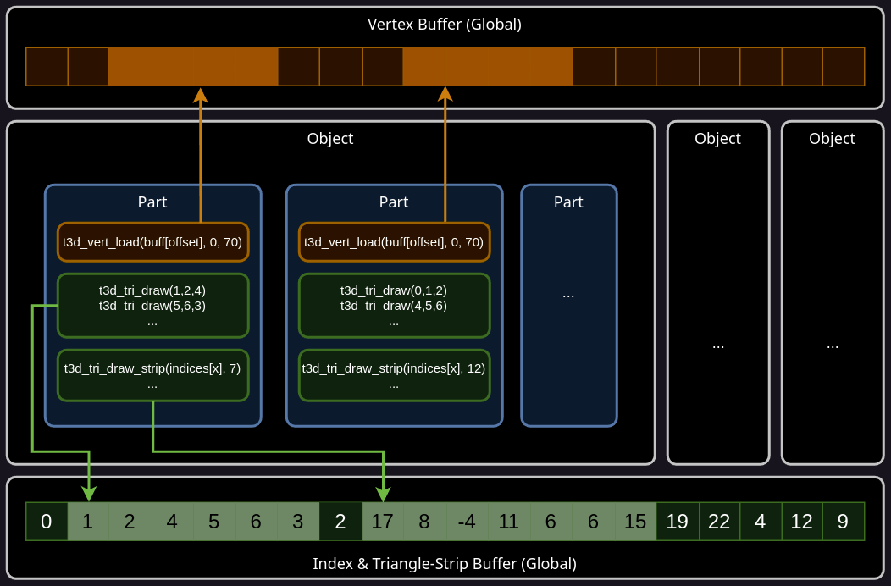
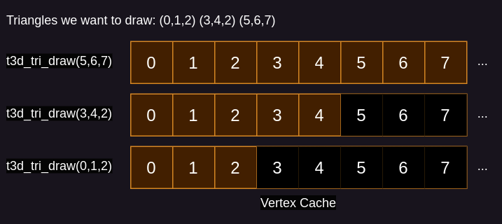
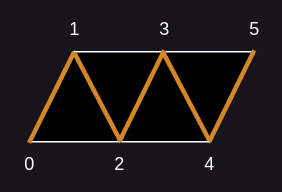
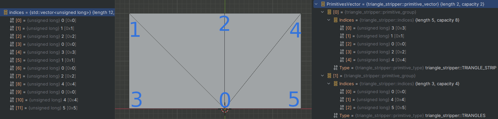
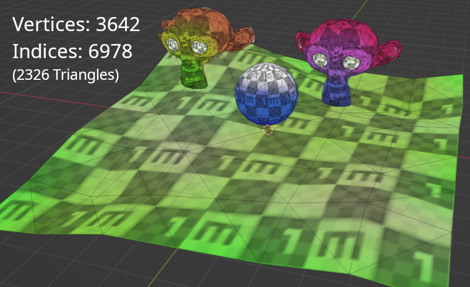

# Model Pre-Processing / Optimizations

This document describes the logic of building and optimizing meshes in the builtin model format.<br>
For the most part this includes handling vertex and triangle/index data at builtime.

## Why?
When converting a model from a generic format like GLTF, the input data can't be expected
to be optimized.<br>
In the case of the N64 we also have some additional constraints due to the hardware.<br>
The biggest one is the 4KB limit for memory we have on the RSP (DMEM).<br>
What's worse it that only parts of it are usable, since common data like the command processing also needs to fit in there.<br>

The general design of t3d's ucode (like others) is to have explicit commands to load vertices into a cache,
which will also perform T&L on them.<br> 
After that, triangles can be drawn referencing loaded vertices by the local index in the cache (0-69).<br>
While this means we may calculate vertices that are not used in the end (e.g. culled), it still seems to be the most efficient way.

Here is the current DMEM layout with the vertex buffer highlighted, each small block is one byte:


Currently, t3d has a cache-size of 70, so we have to somehow split out triangle draws to only reference any of the loaded 70 vertices.
On top, we should optimize these splits to use as little commands and memory as possible.<br>
While both are interlinked, we take a look of the splitting part first now.

For this we have to build up an array of structs that define what vertices to load, and then which triangles to draw after.<br>
This also means the loads/draws are fully known and prepared at build-time.<br>

Here is an example visualization of the structure we want to build:<br>


Note that this is the perspective of the file, so the data you see is in RDRAM.<br>
Whereas e.g. the `t3d_vert_load(..., 0, 70)` is the offset/size of where to load it into the vertex cache.<br>
The reason why there are strips is explained later.<br>
(For more details on how the data is stored check out the file-format: [modelFormat.md](modelFormat.md))

## Splitting
A naive solution would be to just iterate over the original index-buffer,
check which vertices need to be loaded, and then draw triangles referencing them.<br>
If you go above 70 vertices, you overwrite older vertices.<br>

This approach does have a big issue though: Vertices are effectively random from the index buffers view,<br>
so we would need a lot of smaller vertex loads over time.<br>
Worse yet, we may keep reloading the same vertices over again that where just overwritten by something else.<br>
What we ideally want is that each new triangle can re-use as much of the already loaded vertices.<br>
While at the same time having as little and therefore bigger loads as possible.

### Sorting
As a first step, we sort indices in such a way that more used vertices (aka more interconnected triangles) are first.<br>
For this t3d uses the library 'meshoptimizer', specifically the `meshopt_optimizeVertexCache` function.<br>

After that is done we normalize the vertex/index buffer into an array of triangles.<br>
Meaning an array of structs that directly contains 3 vertices each, no indices.<br>
This makes it easier to now generate individual parts of buffers to load.<br>
In the end we will reconstruct a vertex/index buffer from it again.<br>

### Partitioning
A 'Part' is one vertex load commands + all triangles that can be drawn with it.<br>

To create it, we "emit" a triangle into it by writing out it's vertices (if not already there), and then take the index from that buffer as our 3 indices for the triangle.<br>
Note that the vertex buffer is local to the part, so it can contain only 70 vertices.<br>

We start this by emitting the first triangle, which will write 3 new vertices into the empty buffer.<br>
Each time a triangle is emitted, we check if there are any other triangles that could be emitted too without needing new vertices.<br>
As the buffer slowly fills, this becomes more and more likely.<br>
After that, check if there are any that require only 1, and then 2 new vertices.<br>
If none can be emitted, we move on to the next triangle in the list, which will once again emit 3 new vertices.<br>
This process is then repeated until we hit out limit of 70, after which a new part is started.<br>

If no triangles are left, we are done and now left with an array of parts.<br>
This state would already allow us to draw the model at runtime, but we can do better.

### De-Fragmentation
You may notice that a triangle could require a vertex from an earlier part.<br>
This would require an additional vertex load, as the vertex was already emitted, but is not inside our part.<br>
Over time this leads to fragmentation of vertices from the triangles point of view.<br>

The reason we don't want this is that each RSP command has an inherent cost to it.<br>
On top, the vertex load command has a fixed cost too for e.g. setting up registers and the DMA.<br>

To avoid this, we can simply emit the vertex again in our current part.<br>
This also guarantees that every part will only ever need one vertex-load command no matter what.<br>
The tradeoff is that it leads to duplicated vertices in the final mode file.<br>

Taking the model from `examples/99_testscene`, which has 3642 vertices, it will add only 54 duped vertices.<br>
Due to the previous sorting / part-logic, it thankfully seems to keep those low.

It's important to note that this will only increase file-size, the RSP will still load & process the same amount as before.<br>
In fact, memory bandwidth will go slightly down due to needing fewer commands.

For Vertices we are now done!

## Indices
Now we need to tell the RSP how to draw triangles.<br>
For that, we can look at each part from the previous step in isolation.<br>
A part will already contain a list of indices local to the cache, so at runtime we could just iterate over it and emit `t3d_tri_draw` commands per triangle.

This would need one command per triangle, which as mentioned before, drives up runtime.<br>
One detail about RSP commands is that they need 1 byte to encode the overlay/command-id.<br>
Since `t3d_tri_draw` is 8 bytes in size, 1/8 of the memory-bandwidth would be wasted on that.<br>

### Index Buffer

One option is to draw multiple triangles with one command.<br>
Some ucodes have a command for that, in t3d i decided against it and instead go with a proper buffer.<br>
This means a single command will DMA a buffer with arbitrary size, and then process it in it's own compact loop to draw triangles.<br>

The major issue here is DMEM though, t3d is already sitting at 100% usage, so it can't afford any special buffer for it.<br>
However we can re-use parts of the vertex cache for it.<br>

As you draw more and more triangles of a part, more and more vertices will become unused.<br>
Due to the previous steps, those tend to pool up at the end of the buffer.<br>
Since we have knowledge of all triangles, we can determine for every given triangle how much vertices are unused by checking if any following triangle will use it.<br>
By drawing triangles with higher indices first, we can also maximize the chances of larger uninterrupted free memory.<br>

As a simple example:<br>


If there is space available, we can use that as a target to DMA our index buffer to.<br>
The benefit of doing it that way is that we don't have to sacrifice our vertex cache size, and instead can dynamically take up free space.<br>

A single vertex slot is 36 bytes, a single index 2 bytes (direct DMEM address), so we get space for 18 indices per slot meaning 6 triangles.<br>
However this is not very efficient, and instead we can think of a way to compress this index buffer.

### Triangle-Strip

The most popular way of compressing an index buffer is to turn it into a triangle strip.<br>
This uses the fact that triangles are often connected, and you can draw them in a pattern where one or two vertices are implicitly defined by the last one.

As an example, we can draw these 4 triangles with just 6 indices instead of 12:<br>


After the first triangles that still needs 3 indices,<br>
we can assume that the next index simply expand the triangle by re-using the last 2 indices.<br>

#### Reset-Index
At some point the strip stops, mostly because not all triangles are connected.<br>
Instead of emitting individual commands for each strip, we encode a marker to tell that a reset is needed.<br>
This allows us to chain any given strips together, and we can load them all with one command.<br>

For that we mark the first index of a new strip by setting the MSB to 1.<br>
This avoids having to insert special index like some other implementations use.<br>

One nice side-effect is that we could encode regular triangle-lists that are not strips too without any overhead.<br>
This is not useful for the model format, but manual usage of the t3d API can make use of this.

#### Degenerate Triangles

Sometimes triangles only share a single vertex with the last one, or have the wrong winding order, forcing us to start a new strip.<br>
Some libraries will generate strips with degenerate triangles to avoid this.<br>
Meaning they will emit triangles where 2 or 3 indices are the same, which causes it to be discarded, and the indices to shift.<br>
However since we have a restart-index without any overhead, this is almost always worse.<br>
In addition, the ucode would have to explicitly handle this in the loop.<br>
For that reason, degenerated triangles are not generated/supported.<br>

#### Generating Strip-Commands
Now that we know how to encode strips, we can generate them.<br>
We first stripify the index buffer we already have in the part using this library: https://github.com/GPSnoopy/TriStripper <br>
This will return a list of individual strips.<br>

Note that i'm not using meshoptimizer here as it forces degenerate triangles.<br>
TriStripper does explicitly not, and generates shorter sequences than meshoptimizer too.<br>

Here is a very simple mesh, left the input, right the output of TriStripper:

It created one strip, and then a single triangle for the leftover one.

Since we want to have at least some room for our strips, we first make sure that at least 2 vertex slots are unused.<br>
For that we simply draw all triangles that use them using regular triangle commands.<br>
It's important to note that strip commands carry some overhead, needing to start a DMA and setup some registers.<br>
So they are only more efficient when they draw several triangles.<br>

Now starts the main loop, we try to fit as many strips into the two free slots, preferring ones that container larger indices.<br>
This is done to increase the chance to end up with more space after.<br>
All fitting strips are concatenated together using the MSB flag mentioned earlier.<br>
After nothing fits anymore, we can look at all the strips still left.<br>
We then reevaluate how many vertex slots are free, now that triangles have been "drawn".<br>
The process then starts over until not strips are left.<br>

Note: After each iteration, the space of the previous strip is free to use again too, so we only even increase the available space as we go on.<br>

Now we are finally finished!<br>
What we have now is a sequence of vertex loads, followed by single triangle draws, followed by commands to load and draw index buffers.<br>
At that's left at runtime is to simply execute those commands in the given order.<br>

### Example
For some example, we can look at the testmodel in the example `99_testscene`:


This is a single object with 4 disconnected meshes, the right monkey head is also flat-shaded (in the mesh, not as a draw-flag).

And here the log of all the parts:
this shows the amount of vertices loaded at once, then the index count for regular individual triangles (so 3 per tri), and lastly the index count for each of the triangle strip commands.
```
[Scene] Vertices input: 3642
[Scene] Indices input: 6978
[Scene] Vertices out: 3698
[Scene:part-0] Vert: 70 | Idx-Tris: 6 | Idx-Strip: 35 85
[Scene:part-1] Vert: 70 | Idx-Tris: 6 | Idx-Strip: 34 99
[Scene:part-2] Vert: 70 | Idx-Tris: 9 | Idx-Strip: 35 98
[Scene:part-3] Vert: 70 | Idx-Tris: 3 | Idx-Strip: 34 99
[Scene:part-4] Vert: 70 | Idx-Tris: 6 | Idx-Strip: 33 107
[Scene:part-5] Vert: 70 | Idx-Tris: 3 | Idx-Strip: 34 110
[Scene:part-6] Vert: 70 | Idx-Tris: 3 | Idx-Strip: 34 96
[Scene:part-7] Vert: 70 | Idx-Tris: 6 | Idx-Strip: 34 101
[Scene:part-8] Vert: 70 | Idx-Tris: 6 | Idx-Strip: 35 92
[Scene:part-9] Vert: 70 | Idx-Tris: 3 | Idx-Strip: 35 35 81
[Scene:part-10] Vert: 70 | Idx-Tris: 3 | Idx-Strip: 35 95
[Scene:part-11] Vert: 70 | Idx-Tris: 3 | Idx-Strip: 35 127
[Scene:part-12] Vert: 68 | Idx-Tris: 0 | Idx-Strip: 49 109
[Scene:part-13] Vert: 68 | Idx-Tris: 0 | Idx-Strip: 49 18
[Scene:part-14] Vert: 68 | Idx-Tris: 0 | Idx-Strip: 49 18
[Scene:part-15] Vert: 68 | Idx-Tris: 0 | Idx-Strip: 33 35
[Scene:part-16] Vert: 70 | Idx-Tris: 3 | Idx-Strip: 66
[Scene:part-17] Vert: 70 | Idx-Tris: 3 | Idx-Strip: 66
[Scene:part-18] Vert: 68 | Idx-Tris: 0 | Idx-Strip: 35 33
[Scene:part-19] Vert: 68 | Idx-Tris: 0 | Idx-Strip: 35 39
[Scene:part-20] Vert: 68 | Idx-Tris: 0 | Idx-Strip: 49 18
[Scene:part-21] Vert: 68 | Idx-Tris: 0 | Idx-Strip: 35 34
[Scene:part-22] Vert: 68 | Idx-Tris: 0 | Idx-Strip: 35 33
[Scene:part-23] Vert: 70 | Idx-Tris: 3 | Idx-Strip: 66
[Scene:part-24] Vert: 68 | Idx-Tris: 0 | Idx-Strip: 33 35
[Scene:part-25] Vert: 68 | Idx-Tris: 0 | Idx-Strip: 33 36
[Scene:part-26] Vert: 68 | Idx-Tris: 0 | Idx-Strip: 33 35
[Scene:part-27] Vert: 68 | Idx-Tris: 0 | Idx-Strip: 48 19
[Scene:part-28] Vert: 70 | Idx-Tris: 3 | Idx-Strip: 66
[Scene:part-29] Vert: 68 | Idx-Tris: 0 | Idx-Strip: 33 35
[Scene:part-30] Vert: 68 | Idx-Tris: 0 | Idx-Strip: 35 33
[Scene:part-31] Vert: 70 | Idx-Tris: 3 | Idx-Strip: 66
[Scene:part-32] Vert: 68 | Idx-Tris: 0 | Idx-Strip: 35 33
[Scene:part-33] Vert: 68 | Idx-Tris: 0 | Idx-Strip: 49 18
[Scene:part-34] Vert: 68 | Idx-Tris: 0 | Idx-Strip: 35 33
[Scene:part-35] Vert: 68 | Idx-Tris: 0 | Idx-Strip: 47 20
[Scene:part-36] Vert: 68 | Idx-Tris: 0 | Idx-Strip: 49 67
[Scene:part-37] Vert: 70 | Idx-Tris: 3 | Idx-Strip: 66
[Scene:part-38] Vert: 70 | Idx-Tris: 3 | Idx-Strip: 66
[Scene:part-39] Vert: 68 | Idx-Tris: 0 | Idx-Strip: 33 36
[Scene:part-40] Vert: 68 | Idx-Tris: 0 | Idx-Strip: 33 35
[Scene:part-41] Vert: 70 | Idx-Tris: 3 | Idx-Strip: 66
[Scene:part-42] Vert: 70 | Idx-Tris: 3 | Idx-Strip: 66
[Scene:part-43] Vert: 70 | Idx-Tris: 3 | Idx-Strip: 66
[Scene:part-44] Vert: 70 | Idx-Tris: 3 | Idx-Strip: 66
[Scene:part-45] Vert: 70 | Idx-Tris: 3 | Idx-Strip: 66
[Scene:part-46] Vert: 70 | Idx-Tris: 3 | Idx-Strip: 66
[Scene:part-47] Vert: 70 | Idx-Tris: 3 | Idx-Strip: 66
[Scene:part-48] Vert: 70 | Idx-Tris: 3 | Idx-Strip: 66
[Scene:part-49] Vert: 70 | Idx-Tris: 3 | Idx-Strip: 66
[Scene:part-50] Vert: 70 | Idx-Tris: 3 | Idx-Strip: 66
[Scene:part-51] Vert: 68 | Idx-Tris: 0 | Idx-Strip: 48 19
[Scene:part-52] Vert: 70 | Idx-Tris: 3 | Idx-Strip: 66
[Scene:part-53] Vert: 34 | Idx-Tris: 0 | Idx-Strip: 33
[Scene] Idx-Tris: 111, Idx-Strip: 4563 (commands: 90)
```

As mentioned earlier the amount of vertices slightly increased due to the duplication logic.<br>
However we do end up with loads that almost always load the entire cache at once.<br>

The amount of individual triangle we have to draw to free up slots for strips is also very low, usually only taking 0 or 1 triangle.<br>
For indices, we can see a decrease from 6978 to 4674, a save of ~33%.<br>
More importantly, just 127 commands to draw them (`90 + 111/3`).<br>
Without strips that would have been 2326 commands, which is a reduction of `94.5%`!<br>

In terms of memory traffic, triangle strips also have a big effect.<br>
If you sum up the memory-bandwidth needed for both the commands and buffers:
```
  37x t3d_tri_draw()       = 37   * 8b =   296b
+ 90x t3d_tri_draw_strip() = 90   * 8b =   720b
+ strip buffer             = 4563 * 2b =  9126b
================================= Total: 10142b
```
Compared to no strips:
```
  2326x t3d_tri_draw()     = 2326 * 8b = 18608b
================================= Total: 18608b
```
In total a reduction of ~45.5%!<br>
Which ofc has the nice side effect of making other things faster as the memory-bus is less busy.<br>

In terms of RSP performance of the ucode itself, strips in this model saved 1650us.<br>
At the time of writing, bringing it down to 8807us of RSP time.<br>
Note that there are more factors involved to it, so RSP time saved may differ a bit depending on the scene.<br>

## Materials

Objects in a model file are sorted by draw-layer and then materials.<br>
Besides that, nothing can be done that couldn't be done better at runtime.

But to summarize what happens at runtime:<br>
Materials don't store the commands to emit, but rather the desired state of a material.<br>
So this data is evaluated and turned into RDP commands, optionally being recorded into a DPL.<br>
Due to that, t3d offers a C struct that can be passed into the model draw function.<br>
This will keep track of the state to minimize commands even across materials or models.<br>
By default this is always done automatically for you within a model.<br>


## Edge-Cases
There are few special things to handle that i glossed over:

- Skinned meshes require multiple vertex loads, since between each of them they load a different matrix for the bone.<br>
The logic still works as before, as the part is simply further split into multiple ones per bone.<br>
This works since a part does not have to draw any triangles.<br>

- t3d's vertex struct contains 2 vertices at once interleaved. This is done to optimize loads on the RSP.<br>
This needs special handling since it can only have an even amount of vertices in the buffer.
For odd amounts it will either put garbage or a random vertex in the last once.

- The model format allows only for 4 index-buffers per part, which is enough in all my tests.
In the case it's not enough, the rest is emitted as regular `t3d_tri_draw` calls.
While unlikely, this also avoids a dead-lock in case no remaining strip fits into the available DMEM.

- Index buffers are DMA'd, so they must align to 8 bytes on the RSP.<br>
However the vertex slot size is only div. by 4 so we need assume two possible indices less if we start on an odd slot.<br>
The DMA is adjusted 4 bytes forward to still make use of the rest of the buffer.<br>
Doing so causes it to write 4 bytes of garbage into the data after, but that contains the clipping buffer so it's ok.<br>

